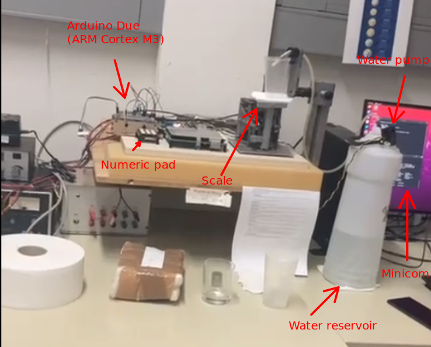

# Wasserpumpe
An Embedded Systems application powered by an Arduino Due Board, which uses an ARM 
Cortex M3 Architecture.

## Usage
This project implements a water dispenser system commanded by certain keys on your
keyboard.

## Technologies
The whole project is controlled by an [Arduino Due Board](https://store.arduino.cc/products/arduino-due), having an [ARM Cortex M3
Architecture](https://developer.arm.com/Processors/Cortex-M3).
 
The processor (Cortex M3) a frequency of 84MHz.

Most of the capabilities of the board are used:
- Interrupt Handling
- Timer Component -> Wave and Capture modes were used to generate a Clock signal for the pump,
and measure certain frequencies respectively
- Serial Comunication -> [Minicom](https://en.wikipedia.org/wiki/Minicom) was used to display real-time messages regarding 
the water filling process and also to send an Input from Keyboard to control the pump.

## Setup:

### Scale
The scale system implies two strings: one stretched and one compressed. By using them
in combination with Timer Component - Capture Mode, and a simple formula:  
,   
(where `c1 = 17942`, `c2 = 40` are the system constants and the f's 
are the two strings' frequencies), we were able to find out the mass in real time.

### Keyboard vs Numeric Pad
An elegant solution in our system is the use of Keyboard for twe two possible commands:
- key C - for calibrating (measuring the mass of the empty cup);
- key P - for pumping (starting the system); by default, the system pumps 25 grams (hardcoded value).    
The user interface waits for our key, so it takes advantage of Serial Comunication.
If we had chosen to use the Numeric Pad (indicated in the picture) and implicitly make use of 
Interrupt Handling, the physical action of pushing a button would send a wave in the
system and influence the strings, hence influencing the mass.

## Modules
- ARM_Cortex_M3_Doku: contains an extensive documentation on the processor specs
- Implementation: it has the source code in `src/main.c` and the necessary Makefile for Make OpenOCD to build the executable for the board
- Include: necessary includes and constants regarding the processor
- Linker
- Media: pictures and videos of the setup
- Source: also important source code for the processor

## Documentation
The present [Dokumentation_DE.pdf](Dokumentation_DE.pdf) is a developer-guide on how to use the project.
> Note: you need to work in Visual Studio Code

## Special Thanks
The project was done under the coordination of Prof. Thomas Horsch and Laboratory Engineer Manfred Pester, both of 
Hochschule Darmstadt of Applied Sciences, Germany.
